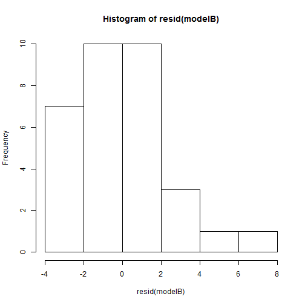
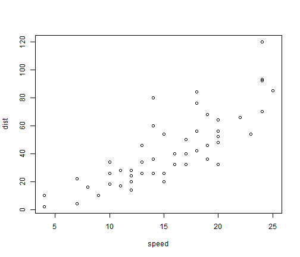

The cars dataset
=====

This is an R Markdown document. Markdown is a simple formatting syntax for authoring web pages (click the **Help** toolbar button for more details on using R Markdown).

When you click the **Knit HTML** button a web page will be generated that includes both content as well as the output of any embedded R code chunks within the document. You can embed an R code chunk like this:

## Executive Summary
target and methods applied

This study aims to explore the relationship between a set of variables and miles per gallon (MPG) using the mtcars dataset included with the base R package. Our analysis provides an answer to the question of whether an automatic or manual transmission is better for miles per gallon (MPG). 


Over the decades, Motor Trend has accumulated an archive of design characteristics and performance measurements of thousands of auto models. We can use these data to estimate the effect of automotive design choices on performance. In this report, I use data ( ) from the 1974 issues of Motor Trend to examine the effect that selection of an
automatic or manual transmission had on fuel economy in the era immediately following the first major oil crisis. I develop a multiple linear regression model on transmission type and 3 other predictors of fuel economy, having 0.8975, and find that the best predictors are related to weight and power-to-weight ratio, not transmission type. The model indicates that selecting a manual transmission-equipped car improves fuel economy by about 0.7605 mpg, with 95% confidence interval (-1.2913 mpg, 2.8124 mpg)–implying that a fuel-economy decrease cannot be ruled out. The large variance in the estimate is unsuprising because of the relatively large variance of fuel economy observations, the small size of the dataset, and its bias towards unusual, editorially interesting cars.


In this article, we will be examining a question that has intrigued many drivers. Is there a difference in miles
per gallon consumed by a car with respect to the fact that it has a manual or automatic transmission? This
is the question we will be trying to answer. Our analysis suggests that cars with manual transmission tend to
be more efficient than cars with manual transmission, but when the weight of a car reaches a threshold of
somewhere around 3.15 - 3.4 thousand pounds, the advantage seems to be reversed and cars with manual
transmission become more efficient.


This report estimates the impact of transmission type on average fuel economy, using the a dataset of 32 vehicles in the mtcars data package. The analysis identifies a statistically significant association between fuel economy and transmission type, supporting automatic vehicles as possessing greater fuel economy when controlling for the weight of the vehicle and its ¼ mile time.


Executive summary : In this report, I examine the effect of the type of transmission of a car on its fuel
consumption efficiency measured in miles per gallon using linear regression modeling. I find that other
features are more appropriate to explain fuel efficiency especially the weight and the 1/4 mile time. Adding
the type of transmission to a linear model including those variables does not add significant information.
In this project I study the database “mtcars” provided in R base.This database contains observations of 11
features of 32 different cars. It does not contain any NULL value. My goal is to answer the following
questions : is an automatic or manual transmission (variable “am”) better for Miles Per Gallon (variable
“mpg”) ? The second part of the project is to quantify how different is the mpg between automatic and
manual transmission.
As this project is done for a course about linear regression models, I will use this technique to answer the
questions. I will proceed as follow : first I will do some explanatory analysis, then I will select the variables
that explain the variance in mpg in order to control for their effect in my final model, then I will assess the
effect of transmission on miles per gallon and answer the questions.


This analysis is presented in the context of someone working for Motor Trend Magazine assigned to a data analysis project. Of interest to the analyst are the variables that help explain the relationship between drive train (automatic or manual) and miles per gallon (MPG). Specifically, two research questions were presented to frame the analysis:
Is an automatic or manual transmission better for MPG?
How different is the MPG between automatic and manual transmissions?
The research questions are addressed first by exploratory data analysis to become familiar with the variables and then statistical modeling to develop a regressionmodel using step-wise regression. The Results section interprets the coefficients and provides two findings: a) manual transmissions provide better MPG; and b) with 95% confidence, a manual transmission is estimated to result in a 0.05 to 5.82 MPG increase (statistically significant difference at 0.05%). Further investigation determined the model was well constructed by using residuals and diagnostics.


The purpose of this project is to explore the relationship between a set of variables and miles per gallon (MPG). Specifically, we
want to answer the following two questions:
1. Is an automatic or manual transmission better for MPG“?
2. How different is the MPG between automatic and manual transmissions?
This study shows that the answer depends on the car’s weight (wt) and the 1/4 mile time (qsec), a performance benchmark for car
acceleration. For light weighted cars, manual tranmission is better for MPG. However, for heavier cars, automatic transmission is
better for MPG. For a given qsec, manual transmission is always better for MPG. For the range of data considered in this study, the
difference in MPG between autmoatic and manual transmission is between -7 and 7.


We analyze the mtcars data set in order to answer the question of whether an automatic or manual transmission is better for miles per gallon (MPG), and to quantify the difference. Our exploratory analysis shows that transmission type is correlated with characteristics such as weight and horsepower.
We fit a variety of linear models to adjust for the confounding factors and estimate the effect of transmission. When we adjust for the confounding factors we are unable to estimate the effect of transmission reliably. Specifically, weight is the predictor that is most highly correlated with MPG, and weight is also very highly correlated with transmission type. This means that our data set is not able to tell us what the effect of transmission type is on MPG.


This study examines the relationship between a set of variables and miles per gallon (MPG) for a collection of cars.
The main purpose of the investigation was to establish whether automatic or manual transmission is better for MPG, and to quantify the relationship between transmission type and MPG, if it indeed exists. When ignoring other variables, data seemed to suggest that manual transmission is better for MPG. However, basic exploratory analysis revealed that a car's weight and horse power are important confounding variables. Consequently, proper regression analysis that accounted for confounding variables suggested that the difference in MPG by transmission type was not statistically significant (based on 5% confidence level). Therefore, a quantitative relationship between MPG and transmission type could not be established. Several regression models were explored and discussed in the context
of the analysis.


### Data Exploration

The mtcars dataset has 11 variables representing 10 features of a car and  one variable indicating the MPG. There are 32 observations where each row represents an automobile model.

Using the summary command, we observed that there were no
missing data points. In order to study the correlation between variables and outcome, we produced the scatterplots of each variable against the outcome.


```r
data(mtcars)
summary(mtcars)
```

```
##       mpg            cyl            disp             hp       
##  Min.   :10.4   Min.   :4.00   Min.   : 71.1   Min.   : 52.0  
##  1st Qu.:15.4   1st Qu.:4.00   1st Qu.:120.8   1st Qu.: 96.5  
##  Median :19.2   Median :6.00   Median :196.3   Median :123.0  
##  Mean   :20.1   Mean   :6.19   Mean   :230.7   Mean   :146.7  
##  3rd Qu.:22.8   3rd Qu.:8.00   3rd Qu.:326.0   3rd Qu.:180.0  
##  Max.   :33.9   Max.   :8.00   Max.   :472.0   Max.   :335.0  
##       drat            wt            qsec            vs       
##  Min.   :2.76   Min.   :1.51   Min.   :14.5   Min.   :0.000  
##  1st Qu.:3.08   1st Qu.:2.58   1st Qu.:16.9   1st Qu.:0.000  
##  Median :3.69   Median :3.33   Median :17.7   Median :0.000  
##  Mean   :3.60   Mean   :3.22   Mean   :17.8   Mean   :0.438  
##  3rd Qu.:3.92   3rd Qu.:3.61   3rd Qu.:18.9   3rd Qu.:1.000  
##  Max.   :4.93   Max.   :5.42   Max.   :22.9   Max.   :1.000  
##        am             gear           carb     
##  Min.   :0.000   Min.   :3.00   Min.   :1.00  
##  1st Qu.:0.000   1st Qu.:3.00   1st Qu.:2.00  
##  Median :0.000   Median :4.00   Median :2.00  
##  Mean   :0.406   Mean   :3.69   Mean   :2.81  
##  3rd Qu.:1.000   3rd Qu.:4.00   3rd Qu.:4.00  
##  Max.   :1.000   Max.   :5.00   Max.   :8.00
```

```r
par(mfrow=c(3,4))
with(mtcars,{
plot(cyl, mpg)
plot(disp, mpg)
plot(hp, mpg)
plot(drat, mpg)
plot(wt, mpg)
plot(qsec, mpg)
plot(vs, mpg)
plot(am, mpg)
plot(gear, mpg)
plot(carb, mpg)
})
```

 


The plot shows categorical variables (cyl, vs, am, gear, carb) that will be transformed from numeric to factors. We are preserving the original dataset in order to build models on it.


```r
data1 <- mtcars
data1$cyl <- factor(data1$cyl)
data1$vs <- factor(data1$vs)
data1$am <- factor(data1$am)
data1$gear <- factor(data1$gear)
data1$carb <- factor(data1$carb)
```


Looking at the mpg column of the correlation matrix, qsec has the smallest
(absolute) correlation ratio, while for cylinder variable it is 0.79, which is
the highest absolute value. This results does not necessarily mean that qsec variable is not significant but that there another variables producing more impact on the outcome of ‘mpg’ variable.


```r
s <- cor(mtcars, use="pairwise.complete.obs", method="kendall")
sort(abs(s[1,2:11]), decreasing = TRUE)
```

```
##    cyl   disp     hp     wt     vs   carb     am   drat   gear   qsec 
## 0.7953 0.7681 0.7428 0.7278 0.5897 0.5044 0.4690 0.4645 0.4332 0.3154
```


### Modelling

-models and comments
-some diagnostics on the models to see if the main assumptions underlying the linear regression are verified

Our next analysis will be to build regression models and examine the marginal impact transmission variable


## Results


## Appendix


```r
s <- cor(mtcars, use="pairwise.complete.obs", method="kendall")
s[1,2:11]
```

```
##     cyl    disp      hp    drat      wt    qsec      vs      am    gear 
## -0.7953 -0.7681 -0.7428  0.4645 -0.7278  0.3154  0.5897  0.4690  0.4332 
##    carb 
## -0.5044
```

```r
sort(s[1,2:11], decreasing = TRUE)
```

```
##      vs      am    drat    gear    qsec    carb      wt      hp    disp 
##  0.5897  0.4690  0.4645  0.4332  0.3154 -0.5044 -0.7278 -0.7428 -0.7681 
##     cyl 
## -0.7953
```

```r
mtcars1 <- mtcars
mtcars1$disp <- log(mtcars1$disp)
mtcars1$hp <- log(mtcars1$hp)
mtcars1$wt <- log(mtcars1$wt)


mtcars2 <- mtcars
mtcars2$disp <- sqrt(mtcars2$disp)
mtcars2$hp <- sqrt(mtcars2$hp)
mtcars2$wt <- sqrt(mtcars2$wt)


cor(mtcars1$mpg, mtcars1$disp)
```

```
## [1] -0.9071
```

```r
cor(mtcars1$mpg, mtcars1$hp)
```

```
## [1] -0.8488
```

```r
cor(mtcars1$wt, mtcars1$wt)
```

```
## [1] 1
```

```r
cor(mtcars2$mpg, mtcars2$disp)
```

```
## [1] -0.8807
```

```r
cor(mtcars2$mpg, mtcars2$hp)
```

```
## [1] -0.8194
```

```r
cor(mtcars2$wt, mtcars2$wt)
```

```
## [1] 1
```

```r
v <- cor(mtcars1$mpg, mtcars1)
sort(v)
```

```
##  [1] -0.9071 -0.9001 -0.8522 -0.8488 -0.5509  0.4187  0.4803  0.5998
##  [9]  0.6640  0.6812  1.0000
```

```r
round(cor(mtcars1[,c(2,3,4,6)]),2)
```

```
##       cyl disp   hp   wt
## cyl  1.00 0.93 0.88 0.80
## disp 0.93 1.00 0.86 0.90
## hp   0.88 0.86 1.00 0.73
## wt   0.80 0.90 0.73 1.00
```

```r
round(cor(mtcars1, mtcars1[,c(2,3,4,6)]),2)
```

```
##        cyl  disp    hp    wt
## mpg  -0.85 -0.91 -0.85 -0.90
## cyl   1.00  0.93  0.88  0.80
## disp  0.93  1.00  0.86  0.90
## hp    0.88  0.86  1.00  0.73
## drat -0.70 -0.76 -0.56 -0.73
## wt    0.80  0.90  0.73  1.00
## qsec -0.59 -0.45 -0.68 -0.18
## vs   -0.81 -0.73 -0.76 -0.56
## am   -0.52 -0.64 -0.35 -0.72
## gear -0.49 -0.55 -0.22 -0.58
## carb  0.53  0.44  0.70  0.44
```

```r
model1 <- lm( mpg ~ wt , data = mtcars1)
summary(model1)
```

```
## 
## Call:
## lm(formula = mpg ~ wt, data = mtcars1)
## 
## Residuals:
##    Min     1Q Median     3Q    Max 
## -3.744 -2.095 -0.367  1.071  6.615 
## 
## Coefficients:
##             Estimate Std. Error t value Pr(>|t|)    
## (Intercept)    39.26       1.76    22.3  < 2e-16 ***
## wt            -17.09       1.51   -11.3  2.4e-12 ***
## ---
## Signif. codes:  0 '***' 0.001 '**' 0.01 '*' 0.05 '.' 0.1 ' ' 1
## 
## Residual standard error: 2.67 on 30 degrees of freedom
## Multiple R-squared:  0.81,	Adjusted R-squared:  0.804 
## F-statistic:  128 on 1 and 30 DF,  p-value: 2.39e-12
```

```r
model2 <- lm( mpg ~ qsec , data = mtcars1)
summary(model2)
```

```
## 
## Call:
## lm(formula = mpg ~ qsec, data = mtcars1)
## 
## Residuals:
##    Min     1Q Median     3Q    Max 
##  -9.88  -3.45  -0.72   2.28  11.65 
## 
## Coefficients:
##             Estimate Std. Error t value Pr(>|t|)  
## (Intercept)   -5.114     10.030   -0.51    0.614  
## qsec           1.412      0.559    2.53    0.017 *
## ---
## Signif. codes:  0 '***' 0.001 '**' 0.01 '*' 0.05 '.' 0.1 ' ' 1
## 
## Residual standard error: 5.56 on 30 degrees of freedom
## Multiple R-squared:  0.175,	Adjusted R-squared:  0.148 
## F-statistic: 6.38 on 1 and 30 DF,  p-value: 0.0171
```

```r
model3 <- lm( mpg ~ hp , data = mtcars1)
summary(model3)
```

```
## 
## Call:
## lm(formula = mpg ~ hp, data = mtcars1)
## 
## Residuals:
##    Min     1Q Median     3Q    Max 
## -4.943 -1.705 -0.493  1.719  8.646 
## 
## Coefficients:
##             Estimate Std. Error t value Pr(>|t|)    
## (Intercept)    72.64       6.00   12.10  4.6e-13 ***
## hp            -10.76       1.22   -8.79  8.4e-10 ***
## ---
## Signif. codes:  0 '***' 0.001 '**' 0.01 '*' 0.05 '.' 0.1 ' ' 1
## 
## Residual standard error: 3.24 on 30 degrees of freedom
## Multiple R-squared:  0.72,	Adjusted R-squared:  0.711 
## F-statistic: 77.3 on 1 and 30 DF,  p-value: 8.39e-10
```

```r
model4 <- lm( mpg ~ am , data = mtcars1)
summary(model4)
```

```
## 
## Call:
## lm(formula = mpg ~ am, data = mtcars1)
## 
## Residuals:
##    Min     1Q Median     3Q    Max 
## -9.392 -3.092 -0.297  3.244  9.508 
## 
## Coefficients:
##             Estimate Std. Error t value Pr(>|t|)    
## (Intercept)    17.15       1.12   15.25  1.1e-15 ***
## am              7.24       1.76    4.11  0.00029 ***
## ---
## Signif. codes:  0 '***' 0.001 '**' 0.01 '*' 0.05 '.' 0.1 ' ' 1
## 
## Residual standard error: 4.9 on 30 degrees of freedom
## Multiple R-squared:  0.36,	Adjusted R-squared:  0.338 
## F-statistic: 16.9 on 1 and 30 DF,  p-value: 0.000285
```

```r
modelA <- lm( mpg ~ wt + qsec , data = mtcars1)
summary(modelA)
```

```
## 
## Call:
## lm(formula = mpg ~ wt + qsec, data = mtcars1)
## 
## Residuals:
##    Min     1Q Median     3Q    Max 
## -4.073 -1.388 -0.437  0.749  5.469 
## 
## Coefficients:
##             Estimate Std. Error t value Pr(>|t|)    
## (Intercept)   22.297      4.460    5.00  2.5e-05 ***
## wt           -16.178      1.252  -12.92  1.5e-13 ***
## qsec           0.893      0.222    4.02  0.00038 ***
## ---
## Signif. codes:  0 '***' 0.001 '**' 0.01 '*' 0.05 '.' 0.1 ' ' 1
## 
## Residual standard error: 2.18 on 29 degrees of freedom
## Multiple R-squared:  0.878,	Adjusted R-squared:  0.87 
## F-statistic:  104 on 2 and 29 DF,  p-value: 5.66e-14
```

```r
modelB <- lm( mpg ~ hp + am , data = mtcars1)
summary(modelA)
```

```
## 
## Call:
## lm(formula = mpg ~ wt + qsec, data = mtcars1)
## 
## Residuals:
##    Min     1Q Median     3Q    Max 
## -4.073 -1.388 -0.437  0.749  5.469 
## 
## Coefficients:
##             Estimate Std. Error t value Pr(>|t|)    
## (Intercept)   22.297      4.460    5.00  2.5e-05 ***
## wt           -16.178      1.252  -12.92  1.5e-13 ***
## qsec           0.893      0.222    4.02  0.00038 ***
## ---
## Signif. codes:  0 '***' 0.001 '**' 0.01 '*' 0.05 '.' 0.1 ' ' 1
## 
## Residual standard error: 2.18 on 29 degrees of freedom
## Multiple R-squared:  0.878,	Adjusted R-squared:  0.87 
## F-statistic:  104 on 2 and 29 DF,  p-value: 5.66e-14
```

```r
hist(resid(modelA))
```

 

```r
hist(resid(modelB))
```

 

```r
##***************************************


null = lm(mpg ~ 1, data = mtcars);
full = lm(mpg ~ ., data = mtcars);
forward <- step(null, scope=list(lower=null, upper=full), direction="forward");
```

```
## Start:  AIC=115.9
## mpg ~ 1
## 
##        Df Sum of Sq  RSS   AIC
## + wt    1       848  278  73.2
## + cyl   1       818  308  76.5
## + disp  1       809  317  77.4
## + hp    1       678  448  88.4
## + drat  1       522  604  98.0
## + vs    1       497  630  99.3
## + am    1       405  721 103.7
## + carb  1       342  784 106.4
## + gear  1       260  866 109.6
## + qsec  1       197  929 111.8
## <none>              1126 115.9
## 
## Step:  AIC=73.22
## mpg ~ wt
## 
##        Df Sum of Sq RSS  AIC
## + cyl   1      87.1 191 63.2
## + hp    1      83.3 195 63.8
## + qsec  1      82.9 196 63.9
## + vs    1      54.2 224 68.3
## + carb  1      44.6 234 69.6
## + disp  1      31.6 247 71.4
## <none>              278 73.2
## + drat  1       9.1 269 74.2
## + gear  1       1.1 277 75.1
## + am    1       0.0 278 75.2
## 
## Step:  AIC=63.2
## mpg ~ wt + cyl
## 
##        Df Sum of Sq RSS  AIC
## + hp    1     14.55 177 62.7
## + carb  1     13.77 177 62.8
## <none>              191 63.2
## + qsec  1     10.57 181 63.4
## + gear  1      3.03 188 64.7
## + disp  1      2.68 188 64.7
## + vs    1      0.71 190 65.1
## + am    1      0.12 191 65.2
## + drat  1      0.00 191 65.2
## 
## Step:  AIC=62.66
## mpg ~ wt + cyl + hp
## 
##        Df Sum of Sq RSS  AIC
## <none>              177 62.7
## + am    1      6.62 170 63.4
## + disp  1      6.18 170 63.5
## + carb  1      2.52 174 64.2
## + drat  1      2.25 174 64.3
## + qsec  1      1.40 175 64.4
## + gear  1      0.86 176 64.5
## + vs    1      0.06 177 64.7
```

```r
backward <- step(full, data=mtcars, direction="backward");
```

```
## Start:  AIC=70.9
## mpg ~ cyl + disp + hp + drat + wt + qsec + vs + am + gear + carb
## 
##        Df Sum of Sq RSS  AIC
## - cyl   1      0.08 148 68.9
## - vs    1      0.16 148 68.9
## - carb  1      0.41 148 69.0
## - gear  1      1.35 149 69.2
## - drat  1      1.63 149 69.2
## - disp  1      3.92 151 69.7
## - hp    1      6.84 154 70.3
## - qsec  1      8.86 156 70.8
## <none>              148 70.9
## - am    1     10.55 158 71.1
## - wt    1     27.01 174 74.3
## 
## Step:  AIC=68.92
## mpg ~ disp + hp + drat + wt + qsec + vs + am + gear + carb
## 
##        Df Sum of Sq RSS  AIC
## - vs    1      0.27 148 67.0
## - carb  1      0.52 148 67.0
## - gear  1      1.82 149 67.3
## - drat  1      1.98 150 67.3
## - disp  1      3.90 152 67.7
## - hp    1      7.36 155 68.5
## <none>              148 68.9
## - qsec  1     10.09 158 69.0
## - am    1     11.84 159 69.4
## - wt    1     27.03 175 72.3
## 
## Step:  AIC=66.97
## mpg ~ disp + hp + drat + wt + qsec + am + gear + carb
## 
##        Df Sum of Sq RSS  AIC
## - carb  1      0.69 148 65.1
## - gear  1      2.14 150 65.4
## - drat  1      2.21 150 65.4
## - disp  1      3.65 152 65.8
## - hp    1      7.11 155 66.5
## <none>              148 67.0
## - am    1     11.57 159 67.4
## - qsec  1     15.68 164 68.2
## - wt    1     27.38 175 70.4
## 
## Step:  AIC=65.12
## mpg ~ disp + hp + drat + wt + qsec + am + gear
## 
##        Df Sum of Sq RSS  AIC
## - gear  1       1.6 150 63.5
## - drat  1       1.9 150 63.5
## <none>              148 65.1
## - disp  1      10.1 159 65.2
## - am    1      12.3 161 65.7
## - hp    1      14.8 163 66.2
## - qsec  1      26.4 175 68.4
## - wt    1      69.1 218 75.3
## 
## Step:  AIC=63.46
## mpg ~ disp + hp + drat + wt + qsec + am
## 
##        Df Sum of Sq RSS  AIC
## - drat  1       3.3 153 62.2
## - disp  1       8.5 159 63.2
## <none>              150 63.5
## - hp    1      13.3 163 64.2
## - am    1      20.0 170 65.5
## - qsec  1      25.6 176 66.5
## - wt    1      67.6 218 73.4
## 
## Step:  AIC=62.16
## mpg ~ disp + hp + wt + qsec + am
## 
##        Df Sum of Sq RSS  AIC
## - disp  1       6.6 160 61.5
## <none>              153 62.2
## - hp    1      12.6 166 62.7
## - qsec  1      26.5 180 65.3
## - am    1      32.2 186 66.3
## - wt    1      69.0 222 72.1
## 
## Step:  AIC=61.52
## mpg ~ hp + wt + qsec + am
## 
##        Df Sum of Sq RSS  AIC
## - hp    1       9.2 169 61.3
## <none>              160 61.5
## - qsec  1      20.2 180 63.3
## - am    1      26.0 186 64.3
## - wt    1      78.5 239 72.3
## 
## Step:  AIC=61.31
## mpg ~ wt + qsec + am
## 
##        Df Sum of Sq RSS  AIC
## <none>              169 61.3
## - am    1      26.2 195 63.9
## - qsec  1     109.0 278 75.2
## - wt    1     183.3 353 82.8
```

```r
stepwise <- step(null, scope = list(upper=full), data=mtcars, direction="both");
```

```
## Start:  AIC=115.9
## mpg ~ 1
## 
##        Df Sum of Sq  RSS   AIC
## + wt    1       848  278  73.2
## + cyl   1       818  308  76.5
## + disp  1       809  317  77.4
## + hp    1       678  448  88.4
## + drat  1       522  604  98.0
## + vs    1       497  630  99.3
## + am    1       405  721 103.7
## + carb  1       342  784 106.4
## + gear  1       260  866 109.6
## + qsec  1       197  929 111.8
## <none>              1126 115.9
## 
## Step:  AIC=73.22
## mpg ~ wt
## 
##        Df Sum of Sq  RSS   AIC
## + cyl   1        87  191  63.2
## + hp    1        83  195  63.8
## + qsec  1        83  195  63.9
## + vs    1        54  224  68.3
## + carb  1        45  234  69.6
## + disp  1        32  247  71.4
## <none>               278  73.2
## + drat  1         9  269  74.2
## + gear  1         1  277  75.1
## + am    1         0  278  75.2
## - wt    1       848 1126 115.9
## 
## Step:  AIC=63.2
## mpg ~ wt + cyl
## 
##        Df Sum of Sq RSS  AIC
## + hp    1      14.6 177 62.7
## + carb  1      13.8 177 62.8
## <none>              191 63.2
## + qsec  1      10.6 181 63.4
## + gear  1       3.0 188 64.7
## + disp  1       2.7 188 64.7
## + vs    1       0.7 190 65.1
## + am    1       0.1 191 65.2
## + drat  1       0.0 191 65.2
## - cyl   1      87.1 278 73.2
## - wt    1     117.2 308 76.5
## 
## Step:  AIC=62.66
## mpg ~ wt + cyl + hp
## 
##        Df Sum of Sq RSS  AIC
## <none>              177 62.7
## - hp    1      14.6 191 63.2
## + am    1       6.6 170 63.4
## + disp  1       6.2 170 63.5
## - cyl   1      18.4 195 63.8
## + carb  1       2.5 174 64.2
## + drat  1       2.2 174 64.3
## + qsec  1       1.4 175 64.4
## + gear  1       0.9 176 64.5
## + vs    1       0.1 177 64.7
## - wt    1     115.4 292 76.7
```

```r
null = lm(mpg ~ 1, data = mtcars1);
full = lm(mpg ~ ., data = mtcars1);
forward <- step(null, scope=list(lower=null, upper=full), direction="forward");
```

```
## Start:  AIC=115.9
## mpg ~ 1
## 
##        Df Sum of Sq  RSS   AIC
## + disp  1       927  199  62.6
## + wt    1       912  214  64.8
## + cyl   1       818  308  76.5
## + hp    1       811  315  77.2
## + drat  1       522  604  98.0
## + vs    1       497  630  99.3
## + am    1       405  721 103.7
## + carb  1       342  784 106.4
## + gear  1       260  866 109.6
## + qsec  1       197  929 111.8
## <none>              1126 115.9
## 
## Step:  AIC=62.56
## mpg ~ disp
## 
##        Df Sum of Sq RSS  AIC
## + wt    1      41.9 158 57.0
## + carb  1      32.8 167 58.8
## + hp    1      19.7 180 61.2
## <none>              200 62.6
## + am    1       0.5 199 64.5
## + cyl   1       0.4 199 64.5
## + gear  1       0.4 199 64.5
## + qsec  1       0.2 199 64.5
## + drat  1       0.1 199 64.5
## + vs    1       0.0 199 64.6
## 
## Step:  AIC=57.01
## mpg ~ disp + wt
## 
##        Df Sum of Sq RSS  AIC
## + hp    1      33.8 124 51.3
## + carb  1      25.4 132 53.4
## + qsec  1      25.3 132 53.4
## <none>              158 57.0
## + gear  1       5.4 152 57.9
## + am    1       5.2 152 57.9
## + vs    1       4.9 153 58.0
## + cyl   1       4.7 153 58.0
## + drat  1       2.1 156 58.6
## 
## Step:  AIC=51.28
## mpg ~ disp + wt + hp
## 
##        Df Sum of Sq RSS  AIC
## <none>              124 51.3
## + qsec  1     2.183 122 52.7
## + gear  1     1.484 122 52.9
## + carb  1     1.085 123 53.0
## + am    1     0.662 123 53.1
## + vs    1     0.038 124 53.3
## + cyl   1     0.018 124 53.3
## + drat  1     0.002 124 53.3
```

```r
backward <- step(full, data=mtcars1, direction="backward");
```

```
## Start:  AIC=61.55
## mpg ~ cyl + disp + hp + drat + wt + qsec + vs + am + gear + carb
## 
##        Df Sum of Sq RSS  AIC
## - drat  1      0.02 110 59.6
## - vs    1      0.18 110 59.6
## - am    1      0.95 111 59.8
## - disp  1      1.48 112 60.0
## - carb  1      3.07 113 60.4
## - cyl   1      4.24 114 60.8
## - qsec  1      4.77 115 60.9
## - gear  1      5.72 116 61.2
## <none>              110 61.5
## - hp    1      8.35 118 61.9
## - wt    1     18.68 129 64.6
## 
## Step:  AIC=59.55
## mpg ~ cyl + disp + hp + wt + qsec + vs + am + gear + carb
## 
##        Df Sum of Sq RSS  AIC
## - vs    1      0.18 110 57.6
## - am    1      0.98 111 57.8
## - disp  1      1.50 112 58.0
## - carb  1      3.07 113 58.4
## - cyl   1      4.24 114 58.8
## - qsec  1      4.77 115 58.9
## - gear  1      5.95 116 59.2
## <none>              110 59.6
## - hp    1      8.81 119 60.0
## - wt    1     18.73 129 62.6
## 
## Step:  AIC=57.6
## mpg ~ cyl + disp + hp + wt + qsec + am + gear + carb
## 
##        Df Sum of Sq RSS  AIC
## - am    1      1.25 112 56.0
## - disp  1      1.42 112 56.0
## - carb  1      3.04 113 56.5
## - qsec  1      4.74 115 56.9
## - cyl   1      4.99 115 57.0
## - gear  1      5.82 116 57.2
## <none>              110 57.6
## - hp    1      9.55 120 58.3
## - wt    1     18.57 129 60.6
## 
## Step:  AIC=55.96
## mpg ~ cyl + disp + hp + wt + qsec + gear + carb
## 
##        Df Sum of Sq RSS  AIC
## - disp  1      2.51 114 54.7
## - qsec  1      3.52 115 55.0
## - carb  1      3.59 115 55.0
## - cyl   1      4.97 116 55.4
## <none>              112 56.0
## - gear  1      9.46 121 56.6
## - hp    1      9.56 121 56.6
## - wt    1     18.15 130 58.8
## 
## Step:  AIC=54.68
## mpg ~ cyl + hp + wt + qsec + gear + carb
## 
##        Df Sum of Sq RSS  AIC
## - carb  1       1.5 116 53.1
## - cyl   1       2.9 117 53.5
## - qsec  1       5.6 120 54.2
## <none>              114 54.7
## - gear  1       8.4 122 54.9
## - hp    1      16.8 131 57.1
## - wt    1      59.6 174 66.1
## 
## Step:  AIC=53.09
## mpg ~ cyl + hp + wt + qsec + gear
## 
##        Df Sum of Sq RSS  AIC
## - cyl   1       2.8 118 51.8
## - gear  1       7.2 123 53.0
## - qsec  1       7.3 123 53.0
## <none>              116 53.1
## - hp    1      18.8 134 55.9
## - wt    1      82.6 198 68.3
## 
## Step:  AIC=51.84
## mpg ~ hp + wt + qsec + gear
## 
##        Df Sum of Sq RSS  AIC
## - gear  1       4.4 123 51.0
## - qsec  1       4.5 123 51.0
## <none>              118 51.8
## - hp    1      16.0 134 53.9
## - wt    1      86.7 205 67.4
## 
## Step:  AIC=51.03
## mpg ~ hp + wt + qsec
## 
##        Df Sum of Sq RSS  AIC
## - qsec  1       3.2 126 49.9
## <none>              123 51.0
## - hp    1      14.6 137 52.6
## - wt    1     135.9 259 72.9
## 
## Step:  AIC=49.85
## mpg ~ hp + wt
## 
##        Df Sum of Sq RSS  AIC
## <none>              126 49.9
## - hp    1      87.8 214 64.8
## - wt    1     188.8 315 77.2
```

```r
stepwise <- step(null, scope = list(upper=full), data= mtcars1, direction="both");
```

```
## Start:  AIC=115.9
## mpg ~ 1
## 
##        Df Sum of Sq  RSS   AIC
## + disp  1       927  199  62.6
## + wt    1       912  214  64.8
## + cyl   1       818  308  76.5
## + hp    1       811  315  77.2
## + drat  1       522  604  98.0
## + vs    1       497  630  99.3
## + am    1       405  721 103.7
## + carb  1       342  784 106.4
## + gear  1       260  866 109.6
## + qsec  1       197  929 111.8
## <none>              1126 115.9
## 
## Step:  AIC=62.56
## mpg ~ disp
## 
##        Df Sum of Sq  RSS   AIC
## + wt    1        42  158  57.0
## + carb  1        33  167  58.8
## + hp    1        20  180  61.2
## <none>               199  62.6
## + am    1         0  199  64.5
## + cyl   1         0  199  64.5
## + gear  1         0  199  64.5
## + qsec  1         0  199  64.5
## + drat  1         0  199  64.5
## + vs    1         0  199  64.6
## - disp  1       927 1126 115.9
## 
## Step:  AIC=57.01
## mpg ~ disp + wt
## 
##        Df Sum of Sq RSS  AIC
## + hp    1      33.8 124 51.3
## + carb  1      25.4 132 53.4
## + qsec  1      25.3 132 53.4
## <none>              158 57.0
## + gear  1       5.4 152 57.9
## + am    1       5.2 152 57.9
## + vs    1       4.9 153 58.0
## + cyl   1       4.7 153 58.0
## + drat  1       2.1 156 58.6
## - wt    1      41.9 200 62.6
## - disp  1      56.2 214 64.8
## 
## Step:  AIC=51.28
## mpg ~ disp + wt + hp
## 
##        Df Sum of Sq RSS  AIC
## - disp  1       2.2 126 49.9
## <none>              124 51.3
## + qsec  1       2.2 122 52.7
## + gear  1       1.5 122 52.9
## + carb  1       1.1 123 53.0
## + am    1       0.7 123 53.1
## + vs    1       0.0 124 53.3
## + cyl   1       0.0 124 53.3
## + drat  1       0.0 124 53.3
## - hp    1      33.8 158 57.0
## - wt    1      56.0 180 61.2
## 
## Step:  AIC=49.85
## mpg ~ wt + hp
## 
##        Df Sum of Sq RSS  AIC
## <none>              126 49.9
## + qsec  1       3.2 123 51.0
## + gear  1       3.2 123 51.0
## + disp  1       2.2 124 51.3
## + am    1       1.7 124 51.4
## + cyl   1       0.7 125 51.7
## + vs    1       0.4 126 51.7
## + drat  1       0.3 126 51.8
## + carb  1       0.0 126 51.9
## - hp    1      87.8 214 64.8
## - wt    1     188.8 315 77.2
```

```r
summary(cars)
```

```
##      speed           dist    
##  Min.   : 4.0   Min.   :  2  
##  1st Qu.:12.0   1st Qu.: 26  
##  Median :15.0   Median : 36  
##  Mean   :15.4   Mean   : 43  
##  3rd Qu.:19.0   3rd Qu.: 56  
##  Max.   :25.0   Max.   :120
```

You can also embed plots, for example:


```r
plot(cars)
```

 


** library(knitr)
** pandoc('projectCars.md', format = 'latex')
