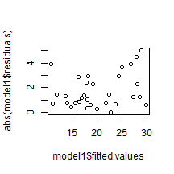

The cars dataset
=====


## Executive Summary

This study aims to explore the relationship between a set of variables and miles per gallon (MPG) using the mtcars dataset included with the base R package. Our analysis provides an answer to the question of whether an automatic or manual transmission is better for miles per gallon (MPG). 


### Data Exploration

The mtcars dataset has 11 variables representing 10 features of a car and  one variable indicating the MPG. There are 32 observations where each row represents an automobile model.

Using the summary command, we observed that there were no missing data points. In order to study the correlation between variables and outcome, we produced the scatterplots of each variable against the outcome.


The plot in Figure 1 shows categorical variables (cyl, vs, am, gear, carb) that will be transformed from numeric to factors. We are preserving the original dataset in order to build models on it.


```r
data1 <- mtcars
data1$cyl <- factor(data1$cyl)
data1$vs <- factor(data1$vs)
data1$am <- factor(data1$am)
data1$gear <- factor(data1$gear)
data1$carb <- factor(data1$carb)
```


Looking at the mpg column of the correlation matrix, qsec has the smallest
(absolute) correlation ratio, while for cylinder variable it is 0.79, which is
the highest absolute value. This results does not necessarily mean that qsec variable is not significant but that there another variables producing more impact on the outcome of ‘mpg’ variable.


```r
s <- cor(mtcars, use="pairwise.complete.obs", method="kendall")
sort(abs(s[1,2:11]), decreasing = TRUE)
```

```
##    cyl   disp     hp     wt     vs   carb     am   drat   gear   qsec 
## 0.7953 0.7681 0.7428 0.7278 0.5897 0.5044 0.4690 0.4645 0.4332 0.3154
```


### Modelling

-models and comments
-some diagnostics on the models to see if the main assumptions underlying the linear regression are verified

At this stage of our analysis, we will build regression models and examine the marginal impact of the transmission variable.
We will use the R function step() in order to perform variable selection. The results of backward-elimination and forward-selection strategies are compared based on the AIC (Akaike's An Information Criterion).


```r
null = lm(mpg ~ 1, data = data1);
full = lm(mpg ~ ., data = data1);
forward <- step(null, scope=list(lower=null, upper=full), direction="forward");
backward <- step(full, data=data1, direction="backward");
stepwise <- step(null, scope = list(upper=full), data= data1, direction="both");
```

All strategies deliver the same final model with an AIC = 61.65. We will try the same approach with the original dataset (without the factor transformation).

mpg ~ wt + cyl + hp + am


```r
null = lm(mpg ~ 1, data = mtcars);
full = lm(mpg ~ ., data = mtcars);
forward <- step(null, scope=list(lower=null, upper=full), direction="forward");
backward <- step(full, data=mtcars, direction="backward");
stepwise <- step(null, scope = list(upper=full), data= mtcars, direction="both");
```

AIC=62.66
mpg ~ wt + cyl + hp

AIC=61.31
mpg ~ wt + qsec + am


Use AIC (Akaike information criterion) for model selection. The AIC takes into account the number of
parameters in the model, and the goodness of fit. So in theory, it not only rewards goodness of fit, but also
encourages parsimony.
Backward, forward, and both direction stepwise regression gives the same model. Backward direction method
is used here


A statistically significant (p-value = 0.002) relationship between mpg and transmission type was found, controlling for the effects of weight and ¼
mile time. There was a strong overall model fit, as demonstrated by the adjusted R-squared value of 0.89. The model residuals are also
homoskedastic and approximately normal, though with a slight positive skew.


The final model has good properties as seen in the residual plot below. It shows the model has good fit and displays constant variance (no
heteroskedasticity), no missing terms, and no patterns that would occur from non-linear fit or from time-based effects.


```r
model0 <- lm( mpg ~ wt + qsec + am, data = mtcars )
model1 <- lm( mpg ~ wt + cyl + hp + am, data = data1 )
```

0
Adjusted R-squared:  0.8336 
1
Adjusted R-squared:  0.8401 


However, before reporting the model results, we
must verify the model conditions are reasonable.

We will check the following assumptions:
- the residuals of the model are nearly normal
- the variability of the residuals is nearly constant
- the residuals are independent
- each variable is linearly related to the outcome


## Results


## Appendix

You can also embed plots, for example:

 


 


  


  


  


** library(knitr)
** pandoc('projectCarsv02.md', format = 'latex')
