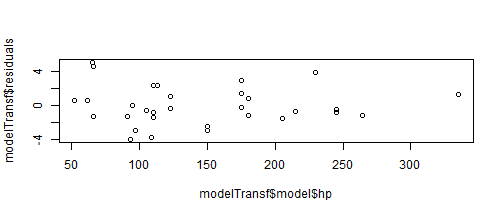
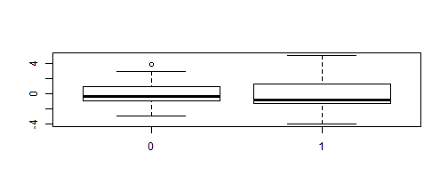

The cars dataset
=====


## Executive Summary

This study aims to explore the relationship between a set of variables and miles per gallon (MPG) using the mtcars dataset included with the base R package. Our analysis provides an answer to the question of whether an automatic or manual transmission is better for miles per gallon (MPG). 


### Data Exploration

The mtcars dataset has 11 variables representing 10 features of a car and  one variable indicating the MPG. There are 32 observations where each row represents an automobile model.Using the summary command, we observed that there were no missing data points. In order to study the correlation between variables and outcome, we produced the scatterplots of each variable against the outcome. The plot in Figure 1 shows categorical variables (cyl, vs, am, gear, carb) that will be transformed from numeric to factors. We are preserving the original dataset in order to build models on it.


Looking at the mpg column of the correlation matrix, qsec has the smallest (absolute) correlation ratio, while for cylinder variable it is 0.79, which is the highest absolute value. This results does not necessarily mean that qsec variable is not significant but that there another variables producing more impact on the outcome of ‘mpg’ variable.


```r
s <- cor(mtcars, use="pairwise.complete.obs", method="kendall")
sort(abs(s[1,2:11]), decreasing = TRUE)
```

```
##    cyl   disp     hp     wt     vs   carb     am   drat   gear   qsec 
## 0.7953 0.7681 0.7428 0.7278 0.5897 0.5044 0.4690 0.4645 0.4332 0.3154
```


### Modelling

At this stage of our analysis, we will build regression models and examine the marginal impact of the transmission variable, using the R function step() in order to perform variable selection. The results of backward-elimination and forward-selection strategies are compared based on the AIC (Akaike's An Information Criterion). All strategies deliver the same final model (mpg ~ wt + cyl + hp + am) with an AIC = 61.65. 


```
## 
## Call:
## lm(formula = mpg ~ wt + cyl + hp + am, data = dataT)
## 
## Residuals:
##    Min     1Q Median     3Q    Max 
## -3.939 -1.256 -0.401  1.125  5.051 
## 
## Coefficients:
##             Estimate Std. Error t value Pr(>|t|)    
## (Intercept)  33.7083     2.6049   12.94  7.7e-13 ***
## wt           -2.4968     0.8856   -2.82   0.0091 ** 
## cyl6         -3.0313     1.4073   -2.15   0.0407 *  
## cyl8         -2.1637     2.2843   -0.95   0.3523    
## hp           -0.0321     0.0137   -2.35   0.0269 *  
## am1           1.8092     1.3963    1.30   0.2065    
## ---
## Signif. codes:  0 '***' 0.001 '**' 0.01 '*' 0.05 '.' 0.1 ' ' 1
## 
## Residual standard error: 2.41 on 26 degrees of freedom
## Multiple R-squared:  0.866,	Adjusted R-squared:  0.84 
## F-statistic: 33.6 on 5 and 26 DF,  p-value: 1.51e-10
```

We will try the same approach with the original dataset (without the factor transformation). The smaller AIC is 61.31 and the best model is mpg ~ wt + qsec + am (using backward-elimination).


The model based on the original dataset has an Adjusted R-squared = 0.8336  while the transformed dataset provides a model with Adjusted R-squared = 0.8401. Therefore, using the Adjusted R-squared and AIC criterion, we select the model based on the modified dataset.


However, before reporting the model results, we must verify that the model conditions are reasonable by checking the following assumptions which graphs are presented at the Appendix:

- the residuals of the model are nearly normal (Figure 2)

- the variability of the residuals is nearly constant (Figure 3)

- the residuals are independent (Figure 4)

- each variable is linearly related to the outcome (Figure 5)


## Conclusions


## Appendix

 

 

  

  

  


** library(knitr)
** pandoc('projectCarsv02.md', format = 'latex')

filen <- "projectCarsv03"
knit(paste0(filen,".md"))
system(paste0("pandoc -s -V geometry:margin=1in ", paste0(filen,".md"), " -t latex -o  ", paste0(filen,".pdf"), " --highlight-style=tango -S"))


