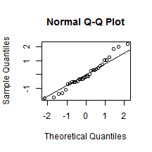

Analysing the mtcars dataset: mpg and transmission
==================================================
**Regression Models (Coursera). September 2014**

## Executive Summary
This study aims to explore the relationship between a set of variables and miles per gallon (mpg) using the mtcars dataset included with the base R package. Our analysis look for an answer to the question of whether an automatic or manual transmission is better for miles per gallon. The regression analysis that accounted for confounding variables found that manual transmissions provide better mpg and, with 95% confidence, a manual transmission is estimated to change mpg by an amount varying from -1.06093 to 4.679356.


## Exploratory data analysis
The mtcars dataset has 11 variables representing 10 features of a car and  one variable indicating the mpg. There are 32 observations where each row represents an automobile model. Using the summary command, we observed that there were no missing data points. In order to study the correlation between variables and outcome, we produced the scatterplots of each variable against the outcome. The plot in Figure 1 shows categorical variables (cyl, vs, am, gear, carb) that will be transformed from numeric to factors. We are preserving the original dataset in order to build models on it.


Looking at the mpg column of the correlation matrix, qsec has the smallest (absolute) correlation ratio, while the cylinder variable obtains 0.79, which is the highest absolute value. This result does not necessarily mean that qsec variable is not significant but that there another variables producing more impact on the outcome of the variable mpg.


```r
s <- cor(mtcars, use="pairwise.complete.obs", method="kendall")
sort(abs(s[1,2:11]), decreasing = TRUE)
```

```
##    cyl   disp     hp     wt     vs   carb     am   drat   gear   qsec 
## 0.7953 0.7681 0.7428 0.7278 0.5897 0.5044 0.4690 0.4645 0.4332 0.3154
```

## Modelling
At this stage of our analysis, we build regression models and examine the marginal impact of the transmission variable, using the R function step() in order to perform variable selection. The results of backward-elimination and forward-selection strategies are compared based on the AIC (Akaike's An Information Criterion). At the end of this process, all strategies deliver the same last model (mpg ~ wt + cyl + hp + am) with an AIC = 61.65. 


```r
null = lm(mpg ~ 1, data = dataT);
full = lm(mpg ~ ., data = dataT);
forward <- step(null, scope=list(lower=null, upper=full), 
                direction="forward", trace=FALSE);
backward <- step(full, data=dataT, direction="backward", trace=FALSE);
stepwise <- step(null, scope = list(upper=full), data= dataT, 
                 direction="both", trace=FALSE);
```


```
## 
## Call:
## lm(formula = mpg ~ wt + cyl + hp + am, data = dataT)
## 
## Residuals:
##    Min     1Q Median     3Q    Max 
## -3.939 -1.256 -0.401  1.125  5.051 
## 
## Coefficients:
##             Estimate Std. Error t value Pr(>|t|)    
## (Intercept)  33.7083     2.6049   12.94  7.7e-13 ***
## wt           -2.4968     0.8856   -2.82   0.0091 ** 
## cyl6         -3.0313     1.4073   -2.15   0.0407 *  
## cyl8         -2.1637     2.2843   -0.95   0.3523    
## hp           -0.0321     0.0137   -2.35   0.0269 *  
## am1           1.8092     1.3963    1.30   0.2065    
## ---
## Signif. codes:  0 '***' 0.001 '**' 0.01 '*' 0.05 '.' 0.1 ' ' 1
## 
## Residual standard error: 2.41 on 26 degrees of freedom
## Multiple R-squared:  0.866,	Adjusted R-squared:  0.84 
## F-statistic: 33.6 on 5 and 26 DF,  p-value: 1.51e-10
```

We apply the same approach to the original dataset (without the factor transformation). The smaller AIC is 61.31 and the best model is mpg ~ wt + qsec + am (using backward-elimination).


The model based on the original dataset has an Adjusted R-squared = 0.8336  while the transformed dataset provides a model with Adjusted R-squared = 0.8401. Therefore, using the Adjusted R-squared and AIC criterion, we select the model based on the modified dataset as the final model.


However, before reporting the model results, we must verify that the model conditions are reasonable by checking the following assumptions using graphs presented at the Appendix: the residuals of the model are nearly normal (Figure 2), the variability of the residuals is nearly constant (Figure 3) and each variable is linearly related to the outcome (Figure 4).

## Conclusions

According to the final model coefficients for the am predictor variable, we estimate a 1.8092 increase in mpg if the vehicle has a manual transmission (versus the reference of an automatic transmission).

Therefore, answering the first question "Is an automatic or manual transmission better for mpg?", the final model coefficient for the predictor am is 1.8092 where the label indicates the variable equals "manual". In other words, when making a comparison to the reference level ("automatic"), the positive value of the coefficient shows that a manual transmission was better for mpg.

About the second question "Quantify the mpg difference between automatic and manual transmissions", 
switching from automatic transmission to manual transmission while holding horse power, weight and cyliders constant, changes mpg by an amount from -1.06093 to 4.679356 with 95% confidence.


```r
confint(modelTransf,level = 0.95)
```

```
##                2.5 %    97.5 %
## (Intercept) 28.35390 39.062744
## wt          -4.31718 -0.676478
## cyl6        -5.92406 -0.138632
## cyl8        -6.85902  2.531671
## hp          -0.06025 -0.003964
## am1         -1.06093  4.679356
```

  
  
  
  

## Appendix

 

 

 

 

 

