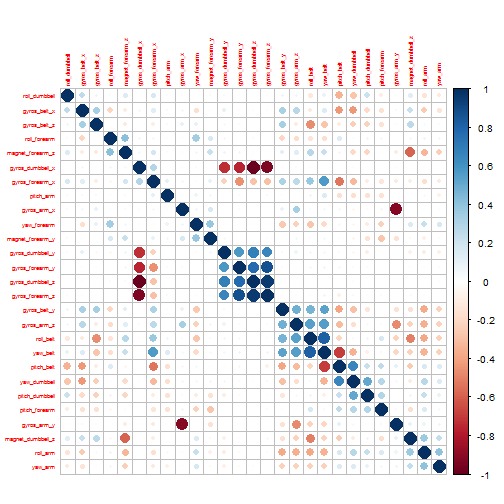

#### Practical Machine Learning (Coursera)

# Predicting Exercise results
#### by Maria Bravo

## Introduction

This document presents the methodology and tasks used to fit and predict a measurements dataset [1] in order to fulfill the requirements of the Coursera Practical Machine Learning course assignment.

In the dataset, each observation has been classified with a "classe" variable which has 5 levels: A, B, C, D, E. This work aims to come up with a prediction algorithm to accurately predict each observation class.


## Analysis
### Data Preparation

- The data was read from the csv file marking the "NA" and "#DIV/0!#" strings as "Not available" values. Next, the columns with only NA values were excluded.


```r

require(caret)
require(randomForest)
require(corrplot)

rawData <- read.table("pml-training.csv", sep = ",", header = TRUE, stringsAsFactors = FALSE, 
    na.strings = c("NA", "", "#DIV/0!"))

NAindex <- apply(rawData, 2, function(x) {
    sum(is.na(x))
})
data <- rawData[, which(NAindex == 0)]
data <- data[, -c(1:7)]
data$classe <- as.factor(data$classe)
```


- Initially there were 19622 rows and 160 columns in the dataset; after the elimination of NA values, 53 variables remained in the cleaned dataset. 

- The dataset was randomly splitted (by setting seeds) into two subsets training (70%)  and testing (30%).


```r

rm(rawData)
set.seed(11230)
inTrain = createDataPartition(data$classe, p = 0.7, list = FALSE)
training = data[inTrain, ]
testing = data[-inTrain, ]
rm(inTrain)
```


13737 rows were assigned at the training subset and 5885 rows to the crossvalidation subset.

- At this step we use the nearZeroVar function to  diagnose predictors that have one unique value or predictors that have both of the following characteristics: 
  * Very few unique values relative to the number of samples.
  * The ratio of the frequency of the most common value to the frequency of the second most common value is large.


```r
trn_nzv <- nearZeroVar(training, saveMetrics = TRUE)
training <- training[!trn_nzv$nzv]
testing <- testing[!trn_nzv$nzv]
```

4 predictors were removed from the training and testing subsets.

- Besides the "classe" variable, we want to work only with numeric values. Therefore, other integer and non-numeric columns will be excluded.


```r
rm(trn_nzv)
trn_numcol <- which(lapply(training, class) %in% c("numeric"))
training <- cbind(training["classe"], training[, trn_numcol])
testing <- cbind(testing["classe"], testing[, trn_numcol])
```

27 numeric predictors were retained.

- Because we want to eliminate redundant variables in order to improve accuracy and readability of the model, we try to remove highly correlated predictors.


```r
rm(trn_numcol)
correlation <- cor(training[2:28])
highCorr <- findCorrelation(correlation, cutoff = 0.95)

if (length(highCorr) > 0) {
    training <- training[, -highCorr]
    testing <- testing[, -highCorr]
}

corrplot(correlation, , order = "hclust", tl.cex = 0.5)
```

 


25 predictors were retained plus the "classe" variable.


### Model Training

We evaluated the results of three training methods: decision trees, linear discrimination analysis (LDA) and random forest. Following are the steps involved:

#### Predicting with a classification tree

```r
rm(correlation)
rm(highCorr)
treeModel <- train(classe ~ ., method = "rpart", data = training)
print(treeModel)
```

```
## CART 
## 
## 13737 samples
##    25 predictors
##     5 classes: 'A', 'B', 'C', 'D', 'E' 
## 
## No pre-processing
## Resampling: Bootstrapped (25 reps) 
## 
## Summary of sample sizes: 13737, 13737, 13737, 13737, 13737, 13737, ... 
## 
## Resampling results across tuning parameters:
## 
##   cp    Accuracy  Kappa  Accuracy SD  Kappa SD
##   0.03  0.5       0.4    0.05         0.07    
##   0.04  0.5       0.3    0.06         0.1     
##   0.1   0.3       0.03   0.04         0.05    
## 
## Accuracy was used to select the optimal model using  the largest value.
## The final value used for the model was cp = 0.03.
```


#### Predicting with LDA

```r
ldaModel <- train(classe ~ ., method = "lda", data = training)
print(ldaModel)
```

```
## Linear Discriminant Analysis 
## 
## 13737 samples
##    25 predictors
##     5 classes: 'A', 'B', 'C', 'D', 'E' 
## 
## No pre-processing
## Resampling: Bootstrapped (25 reps) 
## 
## Summary of sample sizes: 13737, 13737, 13737, 13737, 13737, 13737, ... 
## 
## Resampling results
## 
##   Accuracy  Kappa  Accuracy SD  Kappa SD
##   0.5       0.4    0.006        0.008   
## 
## 
```


#### Predicting with random forest.

```r
rfModel <- randomForest(classe ~ ., training)
print(rfModel)
```

```
## 
## Call:
##  randomForest(formula = classe ~ ., data = training) 
##                Type of random forest: classification
##                      Number of trees: 500
## No. of variables tried at each split: 5
## 
##         OOB estimate of  error rate: 0.58%
## Confusion matrix:
##      A    B    C    D    E class.error
## A 3900    3    1    0    2    0.001536
## B   12 2637    8    1    0    0.007901
## C    0    8 2372   15    1    0.010017
## D    0    0   19 2232    1    0.008881
## E    0    0    4    4 2517    0.003168
```


## Model Accuracy: Out-of-sample error

The different models accuracy will be measured using the testing subset

#### Evaluating the classification tree model

```r
prediction <- predict(treeModel, testing)
print(confusionMatrix(prediction, testing$classe))
```

```
## Confusion Matrix and Statistics
## 
##           Reference
## Prediction    A    B    C    D    E
##          A 1314  507  200  347   77
##          B    5  229   26    5    7
##          C  262  208  745  434  235
##          D    0    0    0    0    0
##          E   93  195   55  178  763
## 
## Overall Statistics
##                                         
##                Accuracy : 0.518         
##                  95% CI : (0.506, 0.531)
##     No Information Rate : 0.284         
##     P-Value [Acc > NIR] : <2e-16        
##                                         
##                   Kappa : 0.38          
##  Mcnemar's Test P-Value : <2e-16        
## 
## Statistics by Class:
## 
##                      Class: A Class: B Class: C Class: D Class: E
## Sensitivity             0.785   0.2011    0.726    0.000    0.705
## Specificity             0.731   0.9909    0.766    1.000    0.892
## Pos Pred Value          0.537   0.8419    0.395      NaN    0.594
## Neg Pred Value          0.895   0.8379    0.930    0.836    0.931
## Prevalence              0.284   0.1935    0.174    0.164    0.184
## Detection Rate          0.223   0.0389    0.127    0.000    0.130
## Detection Prevalence    0.415   0.0462    0.320    0.000    0.218
## Balanced Accuracy       0.758   0.5960    0.746    0.500    0.798
```


#### Evaluating the LDA model

```r
prediction <- predict(ldaModel, testing)
print(confusionMatrix(prediction, testing$classe))
```

```
## Confusion Matrix and Statistics
## 
##           Reference
## Prediction    A    B    C    D    E
##          A 1249  301  222   94  168
##          B  100  308   67  117  124
##          C  109  154  548  121  190
##          D  159  151   78  476  139
##          E   57  225  111  156  461
## 
## Overall Statistics
##                                        
##                Accuracy : 0.517        
##                  95% CI : (0.504, 0.53)
##     No Information Rate : 0.284        
##     P-Value [Acc > NIR] : <2e-16       
##                                        
##                   Kappa : 0.385        
##  Mcnemar's Test P-Value : <2e-16       
## 
## Statistics by Class:
## 
##                      Class: A Class: B Class: C Class: D Class: E
## Sensitivity             0.746   0.2704   0.5341   0.4938   0.4261
## Specificity             0.814   0.9140   0.8819   0.8929   0.8857
## Pos Pred Value          0.614   0.4302   0.4884   0.4746   0.4564
## Neg Pred Value          0.890   0.8392   0.8996   0.9000   0.8726
## Prevalence              0.284   0.1935   0.1743   0.1638   0.1839
## Detection Rate          0.212   0.0523   0.0931   0.0809   0.0783
## Detection Prevalence    0.346   0.1217   0.1907   0.1704   0.1716
## Balanced Accuracy       0.780   0.5922   0.7080   0.6933   0.6559
```


#### Evaluating the random forest model

```r
prediction <- predict(rfModel, testing)
print(confusionMatrix(prediction, testing$classe))
```

```
## Confusion Matrix and Statistics
## 
##           Reference
## Prediction    A    B    C    D    E
##          A 1672    4    0    0    0
##          B    2 1129    2    0    0
##          C    0    6 1019    2    1
##          D    0    0    5  960    4
##          E    0    0    0    2 1077
## 
## Overall Statistics
##                                         
##                Accuracy : 0.995         
##                  95% CI : (0.993, 0.997)
##     No Information Rate : 0.284         
##     P-Value [Acc > NIR] : <2e-16        
##                                         
##                   Kappa : 0.994         
##  Mcnemar's Test P-Value : NA            
## 
## Statistics by Class:
## 
##                      Class: A Class: B Class: C Class: D Class: E
## Sensitivity             0.999    0.991    0.993    0.996    0.995
## Specificity             0.999    0.999    0.998    0.998    1.000
## Pos Pred Value          0.998    0.996    0.991    0.991    0.998
## Neg Pred Value          1.000    0.998    0.999    0.999    0.999
## Prevalence              0.284    0.194    0.174    0.164    0.184
## Detection Rate          0.284    0.192    0.173    0.163    0.183
## Detection Prevalence    0.285    0.193    0.175    0.165    0.183
## Balanced Accuracy       0.999    0.995    0.996    0.997    0.997
```

         
The accuracy of prediction calculated using random forest was 99.5%. 


```r
testing$predRight <- prediction == testing$classe
table(prediction, testing$predRight)
```

```
##           
## prediction FALSE TRUE
##          A     4 1672
##          B     4 1129
##          C     9 1019
##          D     9  960
##          E     2 1077
```


Given that random forest was the most promising out of all the models tested on the validation set, it was chosen to model the blind set of 20 observations.


# Blind set prediction

In this step, we apply the trained model on the blind data.


```r
rm(prediction)
rm(treeModel)
rm(ldaModel)
goalData <- read.csv("pml-testing.csv", header = TRUE)
answers <- predict(rfModel, goalData)
answers
```

```
##  1  2  3  4  5  6  7  8  9 10 11 12 13 14 15 16 17 18 19 20 
##  B  A  B  A  A  E  D  B  A  A  B  C  B  A  E  E  A  B  B  B 
## Levels: A B C D E
```


## Conclusions

We used random forest for the prediction of the way to perform the barbell lifts in the dataset. The Out-of-sample accuracy was 99.5%. Submitting the scores to the grading system confirmed our expectation of a perfect score 20/20. Note that after each code chunk, obsolete objects have been removed in order to liberate memory.


[1] H.Ugulino, W.; Cardador, D.; Vega, K.; Velloso, E.; Milidiu, R.; Fuks, H. Wearable Computing: Accelerometers' Data Classification of Body Postures and Movements. Proceedings of 21st Brazilian Symposium on Artificial Intelligence. Advances in Artificial Intelligence - SBIA 2012. In: Lecture Notes in Computer Science. , pp. 52-61. Curitiba, PR: Springer Berlin / Heidelberg, 2012.
